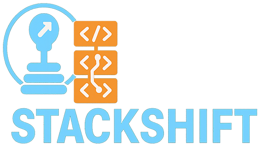

<div align="center">



**Reverse engineer any codebase into fully-specified, spec-driven projects.**

<p>
  
  
</p>

</div>

---

## What is StackShift?

StackShift is a Claude Code plugin that analyzes existing codebases and produces comprehensive documentation, formal specifications, and implementation plans. It works through a 6-step "gear" process:

1. **Analyze** - Detect tech stack, app type, directory structure
2. **Reverse Engineer** - Extract 11 documentation files covering everything from business logic to infrastructure
3. **Create Specs** - Generate formal feature specifications in GitHub Spec Kit format
4. **Gap Analysis** - Compare specs against implementation to find what's missing
5. **Complete Spec** - Interactive Q&A to resolve ambiguities
6. **Implement** - Build missing features from specs

You choose a path at the start:
- **Greenfield** - Extract business logic only (tech-agnostic). Use this when rebuilding in a new stack.
- **Brownfield** - Extract business logic + technical details. Use this when managing an existing codebase.

---

## Installation

### From the DDC Marketplace (recommended)

```
/plugin marketplace add git@ghe.coxautoinc.com:DDC-WebPlatform/ddc-webplatform-marketplace.git
/plugin install stackshift
```

Restart Claude Code after installing.

### From source (for development)

```bash
git clone git@ghe.coxautoinc.com:DDC-WebPlatform/stackshift.git
cd stackshift
mkdir -p ~/.claude/plugins/local
ln -s $(pwd) ~/.claude/plugins/local/stackshift
```

Restart Claude Code after linking.

### In the browser (no install)

Copy the contents of `web/WEB_BOOTSTRAP.md` into Claude Code Web (claude.ai/code) after connecting to your repo.

---

## Quick Start

Navigate to your project and tell Claude what you want:

```
"Analyze this codebase"
```

StackShift asks a few setup questions (path, mode, etc.), saves your answers to `.stackshift-state.json`, then walks you through each gear. You can also run it on autopilot:

```
/stackshift.cruise-control
```

This shifts through all 6 gears without stopping.

---

## Commands Reference

### The 6 Gears (core workflow)

| Command | What it does | Time |
|---------|-------------|------|
| `/stackshift.analyze` | Detect tech stack, app type, choose path | ~5 min |
| `/stackshift.reverse-engineer` | Generate 11 docs in `docs/reverse-engineering/` | ~30 min |
| `/stackshift.create-specs` | Create `.specify/` with feature specs | ~30-90 min |
| `/stackshift.gap-analysis` | Compare specs vs code, find gaps | ~15 min |
| `/stackshift.complete-spec` | Interactive Q&A to resolve `[NEEDS CLARIFICATION]` markers | ~30 min |
| `/stackshift.implement` | Build missing features from specs | hours |
| `/stackshift.cruise-control` | Run all 6 gears automatically | ~2-4 hrs |

### Ecosystem & Multi-Repo

| Command | What it does |
|---------|-------------|
| `/stackshift.discover` | Start with one repo, find all related repos via integration signals |
| `/stackshift.batch` | Process multiple repos in parallel (3-10 at a time) |
| `/stackshift.reimagine` | Load docs from multiple repos, brainstorm a unified redesign |
| `/stackshift.integration-analysis` | Map how systems connect, produce phased implementation plan |

### Architecture & Specs

| Command | What it does |
|---------|-------------|
| `/stackshift.architect` | Generate architecture doc with Mermaid diagrams and ADRs |
| `/stackshift.bmad-synthesize` | Auto-generate BMAD artifacts (PRD, Architecture, Epics, UX) |
| `/stackshift.logic-extract` | Trace a specific business logic flow across repos, produce tech-agnostic specs |
| `/stackshift.portable-extract` | Extract tech-agnostic component specs (reusable across projects) |
| `/stackshift.portable-transplant` | Map portable specs to a target project's patterns |
| `/stackshift.widget-migrate` | Migrate legacy widgets (V9/Osiris) to React Router 7 + Iris |

### Spec Management

| Command | What it does |
|---------|-------------|
| `/stackshift.refresh-docs` | Incrementally update docs based on git changes |
| `/stackshift.coverage` | Show which code files are covered by which specs |
| `/stackshift.quality` | Score spec completeness, testability, and clarity |
| `/stackshift.diff` | Compare specs between directories or git commits |
| `/stackshift.review` | Code review across correctness, security, performance |
| `/stackshift.validate` | Run tests + TypeScript checks + spec compliance |
| `/stackshift.modernize` | Upgrade all dependencies to latest versions |

### Spec Kit Commands (available after Gear 3)

| Command | What it does |
|---------|-------------|
| `/speckit.specify` | Create or update a feature spec |
| `/speckit.plan` | Generate an implementation plan for a feature |
| `/speckit.tasks` | Generate dependency-ordered task list |
| `/speckit.implement` | Execute tasks from the task list |
| `/speckit.analyze` | Cross-artifact consistency check |
| `/speckit.clarify` | Ask clarifying questions about underspecified areas |
| `/speckit.constitution` | Create/update project principles |
| `/speckit.checklist` | Generate a custom checklist for a feature |
| `/speckit.taskstoissues` | Convert tasks to GitHub issues |

---

## What Gets Generated

### Gear 2: Reverse Engineering (11 docs)

All written to `docs/reverse-engineering/`:

| Document | Covers |
|----------|--------|
| `functional-specification.md` | Business logic, user stories, personas |
| `data-architecture.md` | Data models, API contracts, domain boundaries |
| `integration-points.md` | External services, APIs, webhooks, data flows |
| `configuration-reference.md` | All config options and how they're managed |
| `operations-guide.md` | Deployment, infrastructure, scalability |
| `technical-debt-analysis.md` | Issues, improvements, migration priority matrix |
| `observability-requirements.md` | Monitoring, logging, alerting |
| `visual-design-system.md` | UI/UX patterns, design tokens, components |
| `test-documentation.md` | Testing strategy, coverage, requirements |
| `business-context.md` | Product vision, personas, business goals |
| `decision-rationale.md` | Technology rationale, ADRs, design principles |

### Gear 3: Specifications

Written to `.specify/memory/`:

```
.specify/
  memory/
    constitution.md          # Project principles
    F001-feature-name/
      spec.md                # Feature specification
      plan.md                # Implementation plan
      tasks.md               # Task list
    F002-another-feature/
      ...
```

Each spec marks implementation status: COMPLETE, PARTIAL, or MISSING.

---

## When to Use What

### "I have one app I want to document and manage"

Run the 6-gear process:
```
/stackshift.analyze
```
Then follow the prompts through each gear. Or use `/stackshift.cruise-control` to run it all automatically.

### "I'm rebuilding a legacy app in a new tech stack"

Choose **Greenfield** path during Gear 1. StackShift extracts business logic without any technology specifics, so you can implement in whatever stack you want.

### "I have a bunch of microservices and need to understand how they connect"

Start with ecosystem discovery:
```
/stackshift.discover
```
This scans your starting repo for integration signals (npm packages, Docker Compose refs, env vars, API calls, CI/CD triggers, etc.), searches GitHub for related repos, and presents an ecosystem map. Then:
- `/stackshift.batch` to analyze them all in parallel
- `/stackshift.reimagine` to brainstorm a unified redesign
- `/stackshift.integration-analysis` to map connections and produce implementation plans

### "I need to migrate a legacy widget to React"

Run from your **target platform repo** with the widget ID as an argument:

```
/stackshift.widget-migrate v9.widgets.model-selector.responsive.v1
/stackshift.widget-migrate ws-hours
/stackshift.widget-migrate v9.viewmodel.map.dynamic
```

The pipeline:
1. **Resolves** the widget source automatically (clones the repo if not found locally)
2. **Detects** widget type (V9 Velocity, V9 Viewmodel, Osiris)
3. **Extracts** all business logic, preferences, and component structure
4. **Maps** every preference to a React prop/hook/context equivalent
5. **Maps** every UI component to an Iris design system equivalent
6. **Generates** implementation-ready targeted epics for React Router 7 + Iris + TypeScript
7. **Writes** all specs to `docs/specs/widgets/{widget-name}/` in your target repo

**Output:**
```
docs/specs/widgets/model-selector-responsive/
  portable-component-spec.md    # Business rules, data contracts (BR-*, DC-*, EC-*)
  preference-catalog.md         # Every preference -> React equivalent (PREF-*)
  iris-component-mapping.md     # Legacy UI -> Iris components (COMP-*)
  targeted-epics.md             # Implementation-ready stories for React Router 7 + Iris
  extraction-manifest.json      # Machine-readable metrics and metadata
  migration-report.md           # Complexity assessment, gaps, next steps
```

**BMAD Integration:** The output is designed to feed directly into BMAD's `/create-story` workflow. Run `/create-story` for the relevant epic story and it picks up the widget specs as reference material in Dev Notes. No intermediate synthesis step needed.

**Three modes:** YOLO (fully automatic), Guided (3-8 targeted questions), Interactive (full review).

See the [Widget Migration Guide](docs/widget-migration-guide.md) for the complete workflow.

### "I want BMAD artifacts instead of Spec Kit"

After running Gears 1-2, use:
```
/stackshift.bmad-synthesize
```
Three modes: YOLO (fully automatic), Guided (asks targeted questions), Interactive (section-by-section review).

### "I just need an architecture document"

```
/stackshift.architect
```
Generates architecture doc from reverse-engineering docs + your constraints, with Mermaid diagrams, ADRs, and infrastructure recommendations.

### "My reverse-engineering docs are stale"

```
/stackshift.refresh-docs
```
Diffs against the commit hash from when docs were generated and only updates what changed. Much faster than re-running Gear 2 from scratch.

### "I want to extract reusable component specs I can use in any project"

```
/stackshift.portable-extract
```
Generates tech-agnostic epics and component specs. Then use `/stackshift.portable-transplant` to map them into a specific target project.

---

## Tips

- **State is saved.** StackShift writes `.stackshift-state.json` with your configuration and current gear. If you get interrupted, just say "resume StackShift" and it picks up where you left off.
- **You can skip gears.** Already have docs? Jump to `/stackshift.create-specs`. Already have specs? Jump to `/stackshift.implement`.
- **Batch is fast.** Processing 90 repos took 58 minutes using parallel batches of 5.
- **Commit first.** Start from a clean git state so you can easily see what StackShift generates.

---

## Troubleshooting

**Skills not activating after install?**
Restart Claude Code completely (not just a new conversation). Check with `/plugin list`.

**Claude can't find config files?**
Make sure you're in the project root. Explicitly mention unusual config locations.

**Specs seem inaccurate?**
That's what Gear 5 is for - the interactive Q&A corrects inaccuracies. Review before implementing.

**Context window getting full on large codebases?**
Break monoliths into modules and run per-module. Use `/stackshift.batch` for multi-service setups.

---

## Links

- [Issues](https://ghe.coxautoinc.com/DDC-WebPlatform/stackshift/issues)
- [Changelog](CHANGELOG.md)
- [GitHub Spec Kit](https://github.com/github/spec-kit)
- [BMAD Method](https://github.com/bmadcode/BMAD-METHOD)
