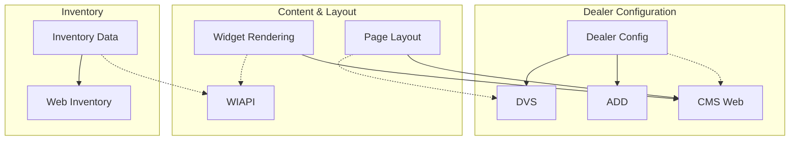
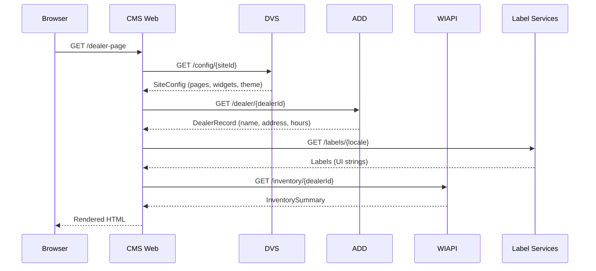

# Cross-System Mapping -- Phase 3 Operation

**Purpose:** Analyze integration surfaces between all profiled systems.
**Called from:** SKILL.md Phase 3
**Output:** `capability-map.md`, `integration-contracts.md`, `data-architecture.md`

---

## ToC

1. [Capability Mapping](#step-1-capability-mapping)
2. [Integration Contract Documentation](#step-2-integration-contract-documentation)
3. [Shared Data Model Analysis](#step-3-shared-data-model-analysis)
4. [End-to-End Flow Tracing](#step-4-end-to-end-flow-tracing)
5. [Dependency Matrix Generation](#step-5-dependency-matrix-generation)
6. [Duplication Detection](#step-6-duplication-detection)
7. [Quality Checklist](#quality-checklist)

---

## Overview

This is the core analytical phase. With all system profiles in hand, look across systems to find:
- **Shared capabilities** -- the same business function served by multiple systems
- **Integration contracts** -- the API surfaces where systems connect
- **Shared data** -- entities that appear in multiple systems (with conflicts)
- **End-to-end flows** -- user journeys that cross system boundaries
- **Dependencies** -- who depends on whom, and how deeply

**IMPORTANT:** Run this phase in the main context. Do not delegate to subagents -- this phase requires synthesizing information from all profiles simultaneously, which subagents cannot access.

---

## Step 1: Capability Mapping

### Process

1. **Extract all capabilities** from every system profile's "Capabilities" section
2. **Normalize capability names** — same business function may have different names across systems
3. **Group by business domain** — e.g., "Inventory", "Configuration", "Content Management", "Analytics"
4. **Map participation** — for each capability, which systems participate and in what role?

### Participation Roles

| Role | Meaning |
|------|---------|
| **Primary** | Owns the core logic and data for this capability |
| **Secondary** | Provides supporting functionality |
| **Consumer** | Only reads/uses the capability's output |
| **Duplicates** | Independently implements the same capability (integration smell) |

### Output Format

```markdown
# Capability Map

## Summary
- **Total capabilities identified:** {N}
- **Cross-system capabilities (2+ systems):** {N}
- **Single-system capabilities:** {N}
- **Duplicated capabilities (same logic, multiple systems):** {N}

## By Business Domain

### Domain: Dealer Configuration
| Capability | DVS | ADD | CMS | WIAPI | Notes |
|------------|-----|-----|-----|-------|-------|
| Dealer metadata storage | Primary | Duplicates | Consumer | Consumer | CONFLICT: Both DVS and ADD store dealer metadata |
| Config hierarchy resolution | Primary | - | Consumer | - | DVS is sole owner |
| Override management | Primary | - | - | - | |
| Site-level customization | Primary | - | Consumer | - | |

### Domain: Content & Layout
| Capability | CMS Web | DVS | WIAPI | Notes |
|------------|---------|-----|-------|-------|
| Page layout resolution | Primary | Secondary (provides config) | - | |
| Widget rendering | Primary | - | Secondary (provides data) | |
| Template selection | Primary | Secondary (provides variation) | - | |

### Domain: Inventory
...
```

### Mermaid Visualization

Generate a capability-centric Mermaid diagram:

```markdown

```

**Legend:** Solid arrows = Primary/Secondary. Dashed arrows = Consumer.

---

## Step 2: Integration Contract Documentation

### Process

1. **For each pair of systems that integrate**, document the contract
2. **Prioritize** — document the most critical integrations first
3. **Include both directions** — System A calls B AND B calls A (if bidirectional)
4. **Note asymmetries** — where one system knows about another but not vice versa

### Per-Contract Documentation

For each system-to-system integration:

```markdown
## Contract: {System A} → {System B}

### Overview
- **Direction:** {A calls B | B calls A | Bidirectional}
- **Protocol:** {REST | GraphQL | Event/Message | Shared DB | File | SDK}
- **Criticality:** {Critical | Important | Optional}
  - Critical = calling system fails without this
  - Important = degraded experience without this
  - Optional = enhancement only

### Endpoints / Interfaces
| Endpoint | Method | Purpose | Auth |
|----------|--------|---------|------|
| /api/v2/config/{siteId} | GET | Fetch site config | API Key |

### Data Exchange
| Direction | Payload Type | Key Fields | Format |
|-----------|-------------|------------|--------|
| Request | SiteConfigRequest | siteId, locale | JSON |
| Response | SiteConfig | pages, widgets, theme | JSON |

### Error Handling
| Error | HTTP Code | Caller Behavior |
|-------|-----------|----------------|
| Site not found | 404 | Show default page |
| Service unavailable | 503 | Serve from cache |
| Rate limited | 429 | Exponential backoff |

### Known Issues
- {Issue description and current workaround}

### SLA / Performance
- **Expected latency:** {p50, p99}
- **Rate limit:** {requests/second}
- **Availability:** {uptime target}
```

### Contract Matrix

Generate a summary matrix showing all integrations:

```markdown
### Integration Matrix

|  | DVS | ADD | CMS Web | WIAPI | Label Svc | Web Inv |
|--|-----|-----|---------|-------|-----------|---------|
| **DVS** | - | REST→ | REST← | - | - | - |
| **ADD** | REST← | - | REST← | REST← | - | - |
| **CMS Web** | REST→ | REST→ | - | REST→ | REST→ | - |
| **WIAPI** | - | REST→ | REST← | - | - | REST→ |
| **Label Svc** | - | - | REST← | - | - | - |
| **Web Inv** | - | - | - | REST← | - | - |

→ = row system calls column system
← = column system calls row system
```

---

## Step 3: Shared Data Model Analysis

### Process

1. **Identify shared entities** — same real-world concept appearing in multiple systems
2. **Map field-level correspondence** — which fields map to which?
3. **Detect conflicts** — different types, different constraints, different defaults
4. **Determine source of truth** — for each field, which system is authoritative?
5. **Document transformations** — how data changes as it crosses boundaries

### Shared Entity Analysis

For each entity that appears in 2+ systems:

```markdown
## Shared Entity: Dealer

### Representations
| System | Type Name | Key Fields | Source |
|--------|-----------|------------|--------|
| DVS | DealerConfig | dealerId, name, oem, group, hierarchy | Primary (config) |
| ADD | DealerRecord | id, dealerName, oemCode, groupId | Primary (metadata) |
| CMS Web | DealerContext | dealerId, name, oem | Consumer (merged) |

### Field Mapping
| Concept | DVS Field | ADD Field | CMS Field | Conflict? |
|---------|-----------|-----------|-----------|-----------|
| Dealer ID | dealerId (string) | id (number) | dealerId (string) | YES: number vs string |
| Name | name | dealerName | name | No (same concept, different field name) |
| OEM | oem (string) | oemCode (enum) | oem (string) | YES: free text vs enum |

### Source of Truth
| Field | Authoritative System | Reason |
|-------|---------------------|--------|
| Dealer ID | ADD | ADD is the system of record for dealer identity |
| Config overrides | DVS | DVS owns the config hierarchy |
| Dealer name | ADD | ADD is the master data source |

### Conflicts Requiring Resolution
| Conflict | Severity | Resolution Strategy |
|----------|----------|-------------------|
| dealerId: string vs number | BLOCKING | Standardize on string in new platform |
| oem: free text vs enum | DEGRADING | Use enum as canonical, map free text |
```

### Data Flow Diagram

For key user journeys, trace data across systems:

```markdown
### Flow: Page Render


```

---

## Step 4: End-to-End Flow Tracing

### Process

1. **Identify key user journeys** that cross system boundaries
2. **Trace the data path** through each system
3. **Note transformations** — where data changes shape
4. **Identify failure points** — where the flow breaks if a system is down
5. **Measure system span** — how many systems does this flow touch?

### Flow Template

```markdown
### Flow: {Flow Name}

**Trigger:** {User action or system event}
**Systems involved:** {list}
**Critical path:** {which systems MUST respond for the flow to work?}
**Graceful degradation:** {what happens if optional systems are down?}

**Steps:**
1. {Actor} → {System A}: {action} ({data})
2. {System A} → {System B}: {action} ({data})
3. {System B} → {System A}: {response} ({data})
4. {System A} → {Actor}: {result}

**Failure modes:**
| System Down | Impact | Mitigation |
|-------------|--------|------------|
| {System B} | {description} | {cache / fallback / error} |
```

---

## Step 5: Dependency Matrix Generation

### Process

1. **Build adjacency matrix** from integration contracts
2. **Calculate dependency depth** — transitive dependencies (A→B→C means A depends on C)
3. **Identify circular dependencies** — A→B→A (integration smell)
4. **Calculate fan-in/fan-out** — systems with high fan-in are critical infrastructure
5. **Identify orphan systems** — systems with no integrations (verify they belong in scope)

### Metrics

```markdown
### Dependency Metrics

| System | Fan-In | Fan-Out | Depth | Role |
|--------|--------|---------|-------|------|
| DVS | 3 | 0 | 0 | Pure provider (critical infrastructure) |
| ADD | 3 | 1 | 1 | Provider with one dependency |
| CMS Web | 0 | 4 | 2 | Pure consumer (orchestrator) |
| WIAPI | 1 | 2 | 2 | Middleman |

**Fan-in** = number of systems that depend on this system
**Fan-out** = number of systems this system depends on
**Depth** = longest dependency chain from this system

**Critical infrastructure** (high fan-in): DVS, ADD, Label Services
**Orchestrators** (high fan-out): CMS Web
**Middlemen** (both): WIAPI
```

---

## Step 6: Duplication Detection

### Process

1. **Compare capabilities** across systems for functional overlap
2. **Compare data models** for structural overlap
3. **Compare API contracts** for redundant endpoints
4. **Classify duplication type:**

| Type | Description | Example |
|------|-------------|---------|
| **Functional duplication** | Same business logic in multiple systems | Email sending in 3 services |
| **Data duplication** | Same data stored in multiple systems | Dealer name in DVS and ADD |
| **API duplication** | Same data available via multiple APIs | Dealer info from DVS API and ADD API |
| **Logic divergence** | Same concept, different rules | Price calculation differs between systems |

### Output

```markdown
### Duplication Registry

| What's Duplicated | Systems | Type | Risk | Recommendation |
|-------------------|---------|------|------|----------------|
| Dealer metadata | DVS, ADD | Data duplication | HIGH — data divergence | Designate single source of truth |
| Label resolution | CMS Web, WIAPI | Functional duplication | MEDIUM — inconsistent labels | Centralize in Label Services |
```

---

## Quality Checklist

Before completing Phase 3:

- [ ] Capability map covers all capabilities from all system profiles
- [ ] Each capability has participation roles assigned (Primary/Secondary/Consumer/Duplicates)
- [ ] Integration contracts documented for all system-to-system boundaries
- [ ] Each contract includes protocol, auth, error handling, and SLA
- [ ] Shared entities identified with field-level mapping
- [ ] Source of truth designated for each shared field
- [ ] Conflicts flagged with severity (BLOCKING/DEGRADING/COSMETIC)
- [ ] At least 2-3 key flows traced end-to-end with sequence diagrams
- [ ] Dependency matrix generated with fan-in/fan-out metrics
- [ ] Duplication detected and classified
- [ ] Mermaid diagrams generated for capability map and data flows
